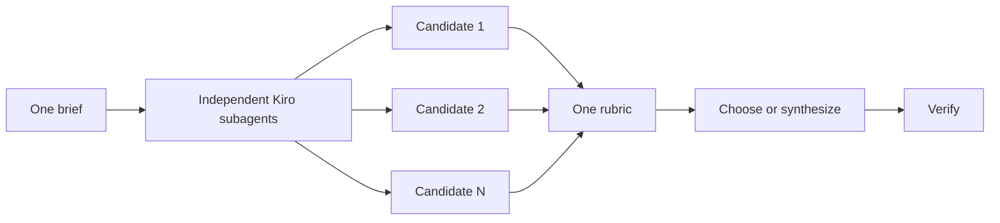

# Design before writing code

One attempt at a hard design often locks in the first plausible shape. Use `/architect` to settle callers and boundaries, `/arena` to compare attempts, `/swarm` to cover independent slices, and `/interrogate` to challenge the result.


## Settle the shape with `/architect`

```text
/architect design the import pipeline before implementation. start from caller usage, data shapes, and ownership.
```

[`/architect`](../../skills/architect/SKILL.md) should understand the touched code first, then produce competing sketches when the decision is expensive. Ask for a checkpoint when you want to review the design before code changes:

```text
/architect with checkpoint. stop after the proposed API, types, and module map.
```

## Compare independent attempts with `/arena`

```text
/arena compare three cache-key designs against compatibility, debuggability, and migration cost
```

[`/arena`](../../skills/arena/SKILL.md) gives the same brief to independent Kiro subagents, then evaluates the outputs under one rubric. Independence and a shared rubric matter more than model branding. Kiro does not guarantee a specific model family for each delegate.

Writing candidates need separate worktrees or directories. Read-only design candidates can remain isolated by context alone.



## Cover independent slices with `/swarm`

```text
/swarm check every package under packages/ against its check.sh. one package per worker. one report.
```

[`/swarm`](../../skills/swarm/SKILL.md) partitions a coverage matrix or race. Each subagent returns `PASS`, `ISSUES`, or `BLOCKED`; the parent reports gaps instead of hiding them.

Use `/arena` when attempts solve the same brief and must be compared. Use `/swarm` when each worker owns a different slice.

## Challenge the result with `/interrogate`

```text
/interrogate review the branch skeptically. do not edit. report only behavioral bugs, regressions, and missing evidence.
```

[`/interrogate`](../../skills/interrogate/SKILL.md) should use independent reviewers and sort findings into action, consideration, and dismissal with reasons. Agreement between independent traces increases confidence; it is not proof by itself. Verify every accepted finding against code or runtime evidence.

## Spend design effort where reversal is expensive

- Small, finished change: one skeptical review.
- Boundary or ownership change: `/architect`.
- Expensive standalone decision: `/arena`.
- Coverage matrix: `/swarm`.
- Contested design: architecture first, independent review before shipping.

Most small changes need no design ceremony. The smallest adequate method is the right one.

Next: [Build and clean the change](./05-build-and-clean.md).
