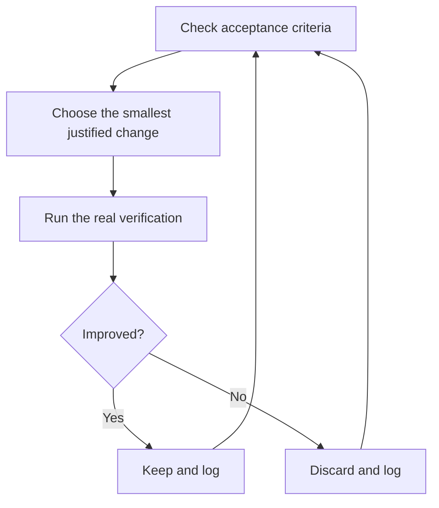

# Run autonomous work safely

Kiro has three different execution choices. Pick one deliberately:

1. CLI `/goal` for a bounded loop in the active CLI session.
2. A Kiro cloud session for work that continues after clients disconnect.
3. Kiro Web Automations for scheduled work against selected repositories.

A prompt alone does not turn a local IDE or CLI chat into a durable background process.


## Write the execution contract

Every autonomous run needs:

- a goal and checkable acceptance criteria;
- the repository, branch, and isolation strategy;
- allowed tools and irreversible-action boundaries;
- external prerequisites and credentials;
- a stop condition and a durable decision log.

Example objective:

```text
migrate every caller to the new parser in a fresh worktree from <base>.
done means zero old callers, all parser fixtures pass, and the old API is deleted.
record each accepted or discarded change in .audit/parser-migration.tsv.
do not merge, publish, or change credentials. stop with evidence if blocked.
```

## Use `/goal` in Kiro CLI

`/goal` is CLI-specific. It derives acceptance criteria from the objective and runs a bounded implementation and verification loop.

```text
/goal --max 5 migrate every parser caller; zero old callers, fixtures pass, old API deleted
```

The default limit is finite. Choose a maximum that matches the task rather than asking for an endless loop. `/goal clear` cancels the active goal but leaves file changes on disk, so inspect the diff and status afterward.

Do not put `/goal` in IDE instructions; it is not an IDE slash command.

## Use a cloud session for detached work

Kiro cloud sessions run in a managed sandbox and can continue when IDE, CLI, Web, or Mobile disconnects. Repositories are cloned server-side; a local uncommitted working copy is not uploaded automatically.

Before starting one, confirm current Kiro prerequisites and limits. Cloud sessions are Preview and currently depend on an eligible plan, a connected GitHub or GitLab account for repository work, supported client versions, available concurrency, and the tools or credentials the task needs.

A cloud session still needs explicit permission boundaries. Continuing after disconnect does not authorize merge, release, secret changes, or destructive operations.

## Use Web Automations for schedules

A Kiro Web Automation is separate from this Power. Configure its prompt, selected repositories, schedule, branch behavior, credentials, and review policy in Kiro Web. The automation runs in a cloud session; pstack neither creates nor activates it during Power installation.

## Keep the run auditable



[`/show-me-your-work`](../../skills/show-me-your-work/SKILL.md) can maintain a TSV decision log. Record the decision, reason, evidence pointer, and result. Never relax the finish condition silently to manufacture success.

For a review handoff, use the diff, tests, logs, and saved chat as explicit artifacts. Kiro CLI can save and restore a JSON conversation with `/chat save PATH` and `/chat load PATH`; Kiro IDE can export a chat archive. Neither artifact is automatically complete context for a new agent.

Independent verification should use a fresh Kiro subagent when practical. The reviewer receives the goal and artifacts, not an instruction to confirm the author's conclusion.

Next: [Steer with principle names](./08-principles.md).
